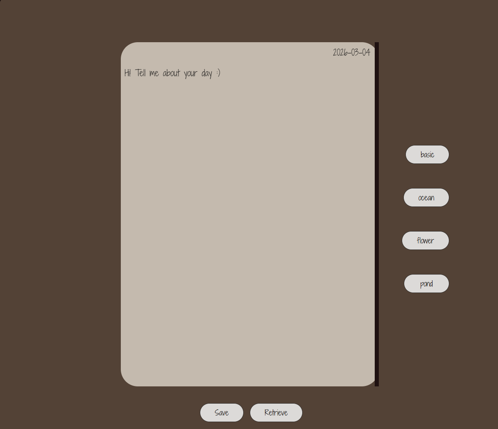
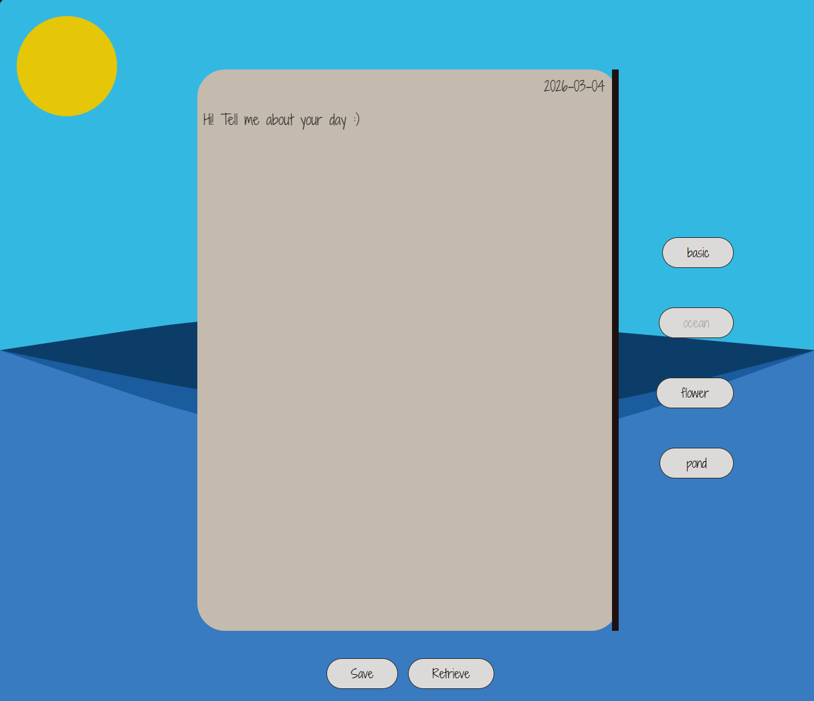
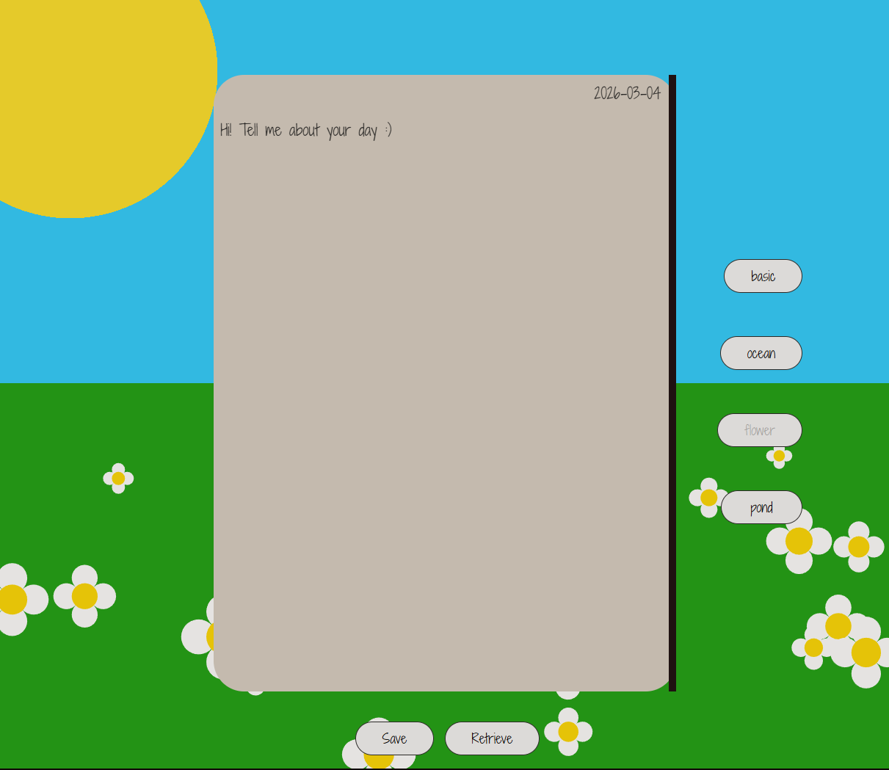
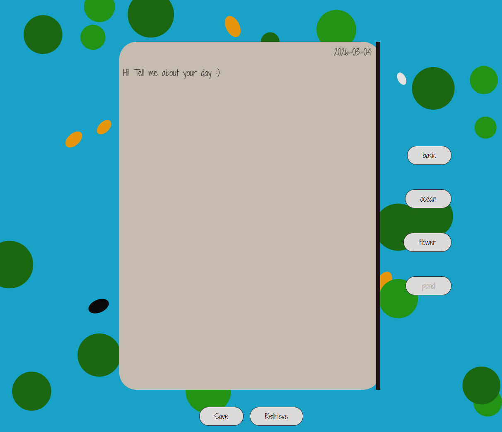

# Dear Diary

Joyce Angelina Lam

[Live Site](https://ajoycel.github.io/cart263/project1/)

## Description
Dear Diary is an interactive web where users are invited to type out their days or how they feel. 

1. There is a date that changes to match the current time(real time date).
2. The journal/diary invites users to share their day.
3. The page has a scroll option to write as much as they want.
4. The entry saves through Chrome Local Storage and is retrievable.
5. There are 4 themes/environements to pick from.

## Screenshot(s)
1. Traditional leather-bound theme

2. Ocean theme

3. Flower field theme

4. Fish pond theme

## Attribution
- This project used Sabine's HTML_5_Canvas code.
- Font from Google font.
- [Real time date](https://www.geeksforgeeks.org/javascript/javascript-date-objects/)
- [ContentEditable](https://www.w3schools.com/jsref/prop_html_contenteditable.asp)
- Ocean wave [referenfce](https://youtu.be/LLfhY4eVwDY?si=1RROuFFVRUxol5FM)
- Bounce off walls [reference](https://developer.mozilla.org/en-US/docs/Games/Tutorials/2D_Breakout_game_pure_JavaScript/Bounce_off_the_walls)

