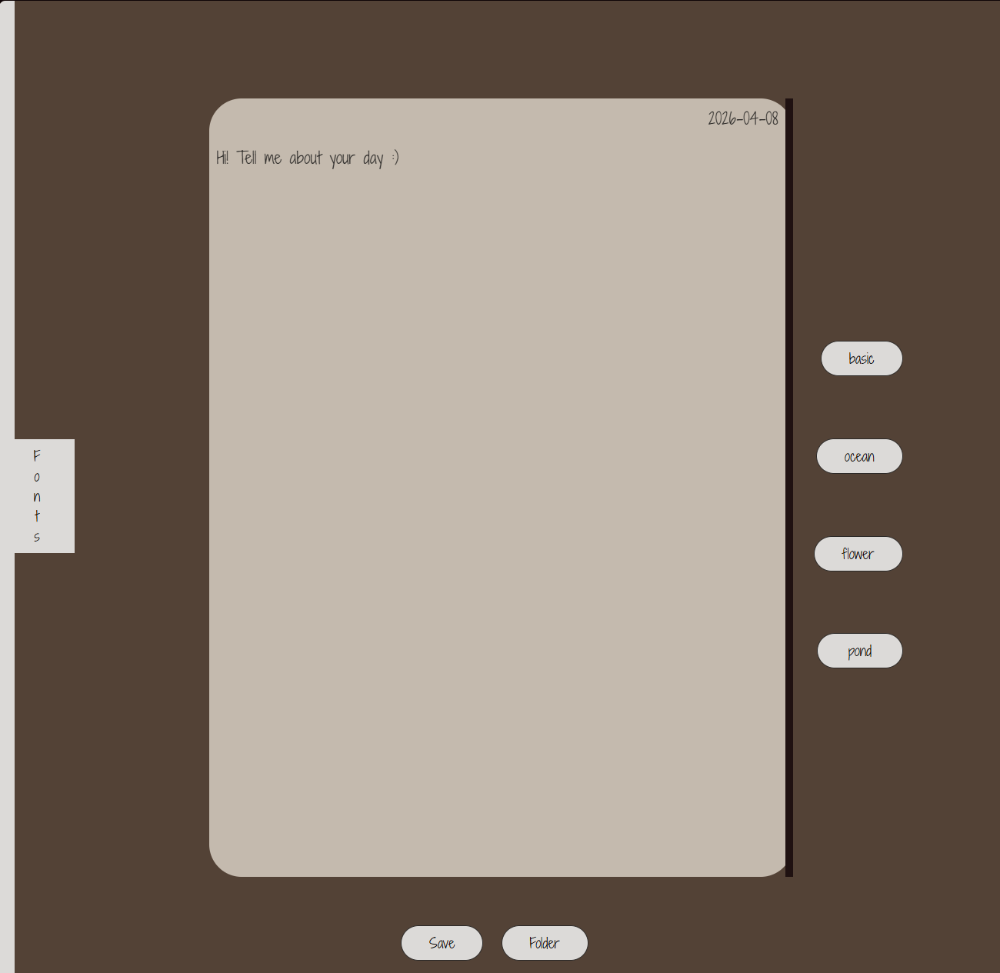
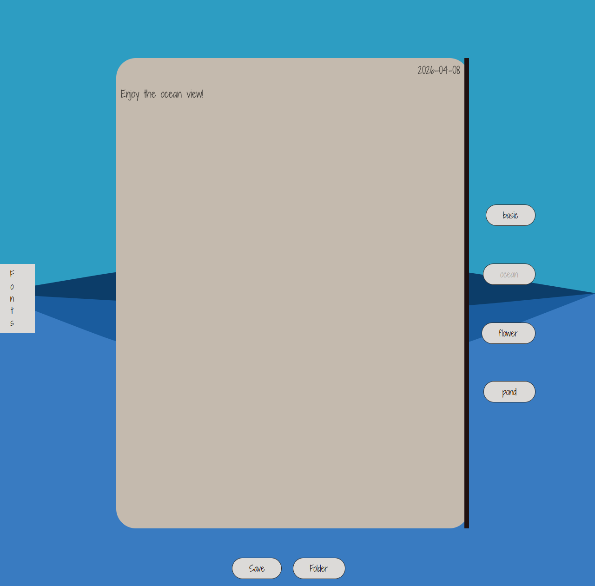
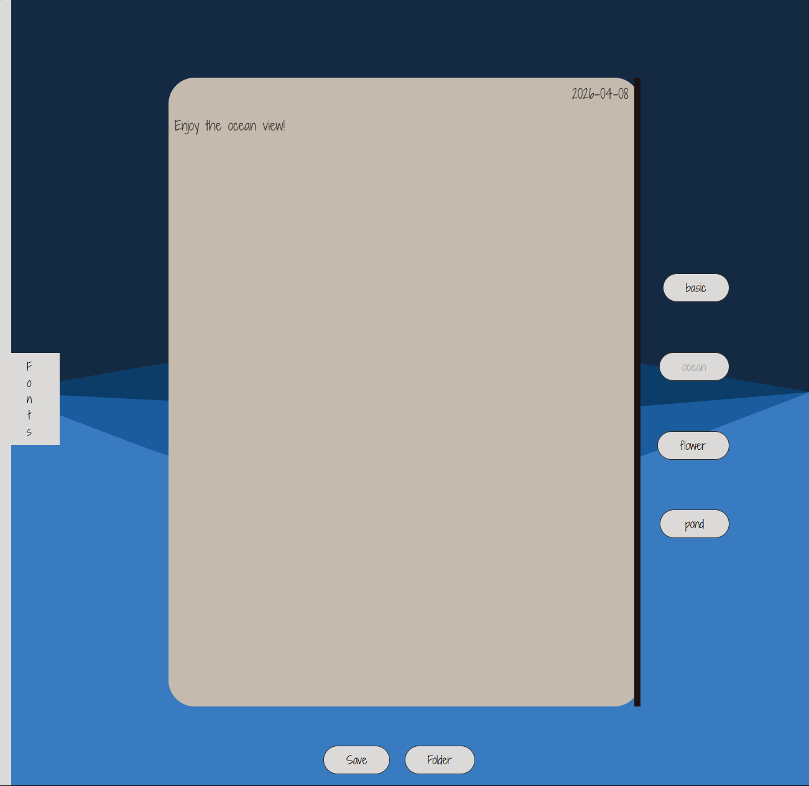
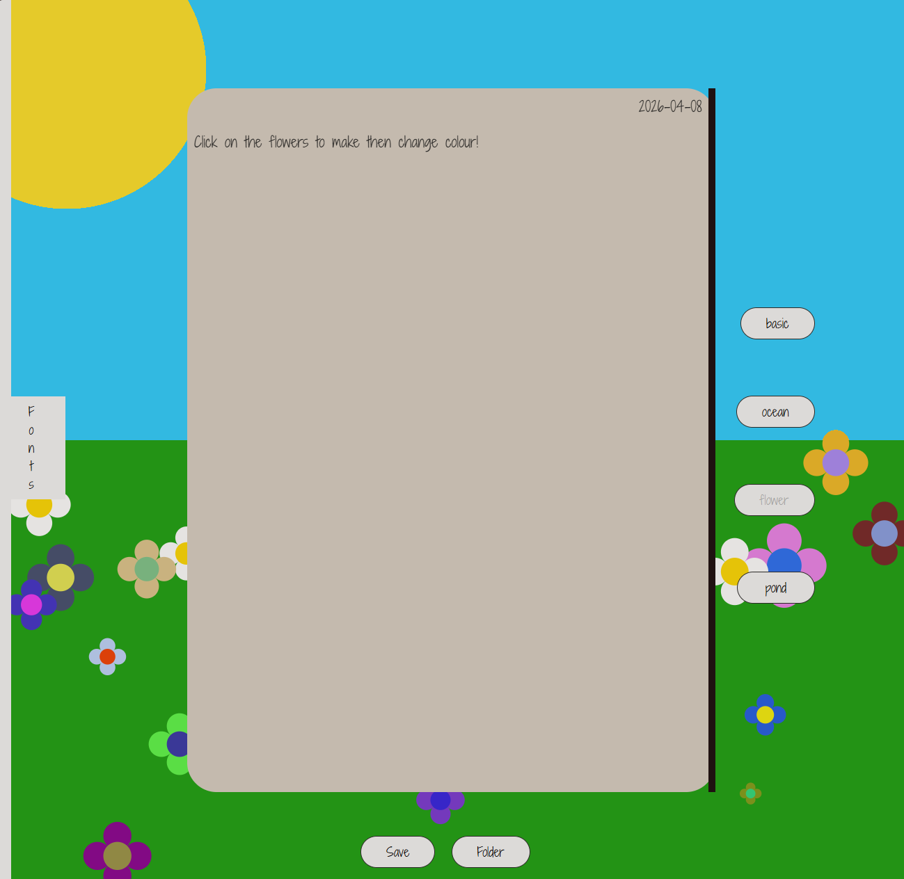
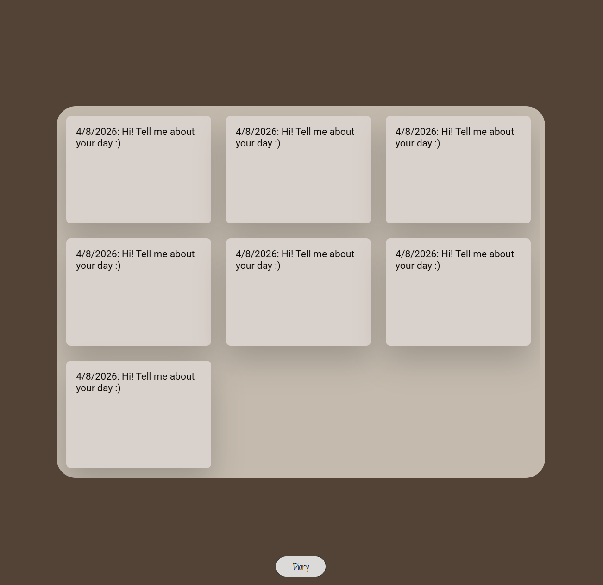

# Dear Diary

Joyce Angelina Lam

[Live Site](https://ajoycel.github.io/cart263/project2/)

## Description
Dear Diary is an interactive web where users are invited to type out their days or how they feel. 

1. There is a date that changes to match the current time(real time date).
2. The journal/diary invites users to share their day.
3. The page has a scroll option to write as much as they want.
4. The entry can be saved in Folder page.
5. Entries can be downloaded by clicking on them.
6. There are 4 themes/environements to pick from and interact with.
7. Selectable fonts to customise the entry.
8. Flowers change colours when clicked.
9. Fishes change direction and colours when clicked.
10. Lilypads shrink and grow back to original size when clicked.
11. Birds chirp when clicked.

## Screenshot(s)
1. Traditional leather-bound theme

2. Ocean theme

3. Flower field theme

4. Fish pond theme

5. Fonts menu

6. Save folder

## Attribution
- This project used Sabine's HTML_5_Canvas code.
- Font from Google font.
- [Real time date](https://www.geeksforgeeks.org/javascript/javascript-date-objects/)
- [ContentEditable](https://www.w3schools.com/jsref/prop_html_contenteditable.asp)
- Ocean wave [referenfce](https://youtu.be/LLfhY4eVwDY?si=1RROuFFVRUxol5FM)
- Bounce off walls [reference](https://developer.mozilla.org/en-US/docs/Games/Tutorials/2D_Breakout_game_pure_JavaScript/Bounce_off_the_walls)
- Save entry stringify + parse [reference](https://stackoverflow.com/questions/65908096/how-can-i-store-multiple-values-inside-one-localstorage-key?utm_source=chatgpt.com)
- Entry download [reference](https://coreui.io/answers/how-to-download-a-file-in-javascript/) 
- Audio from Freesound.
- [GenerateRandomHexCode](https://dev.to/thecodepixi/what-the-hex-how-to-generate-random-hex-color-codes-in-javascript-21n)
- [drawImage()](https://developer.mozilla.org/en-US/docs/Web/API/CanvasRenderingContext2D/drawImage)
- [texture](https://polyhaven.com/a/brown_leather)
- raycasting zoom [reference](https://discourse.threejs.org/t/zoom-into-object-and-open-popup-on-click/40337)
